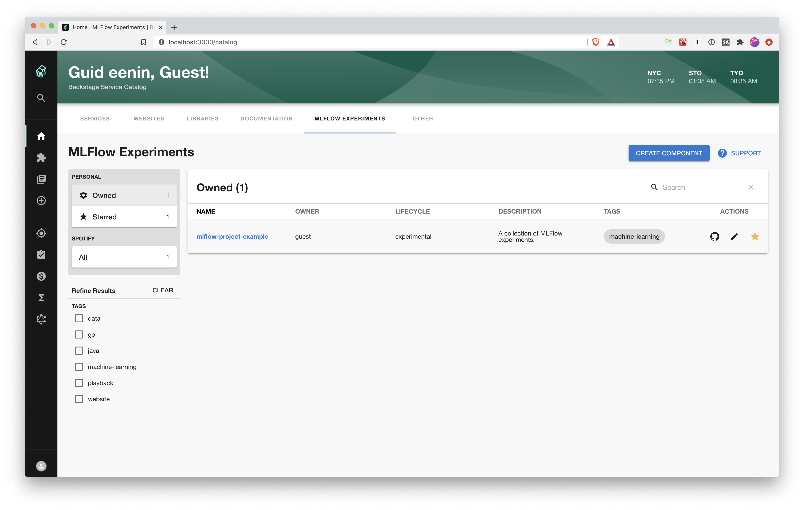
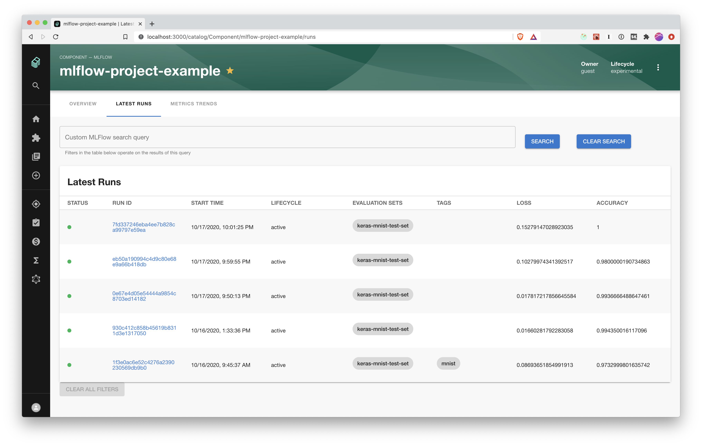
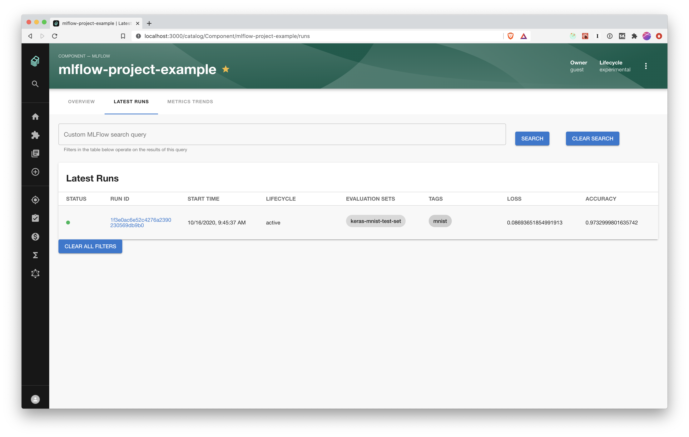
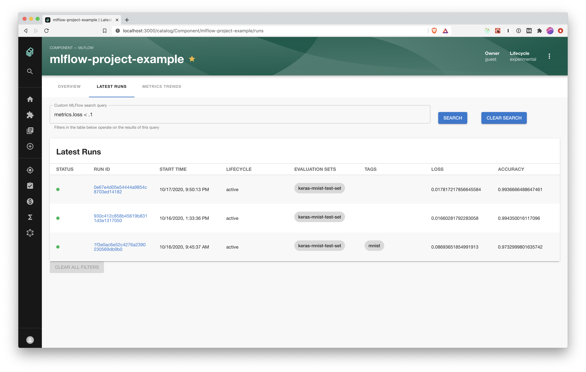
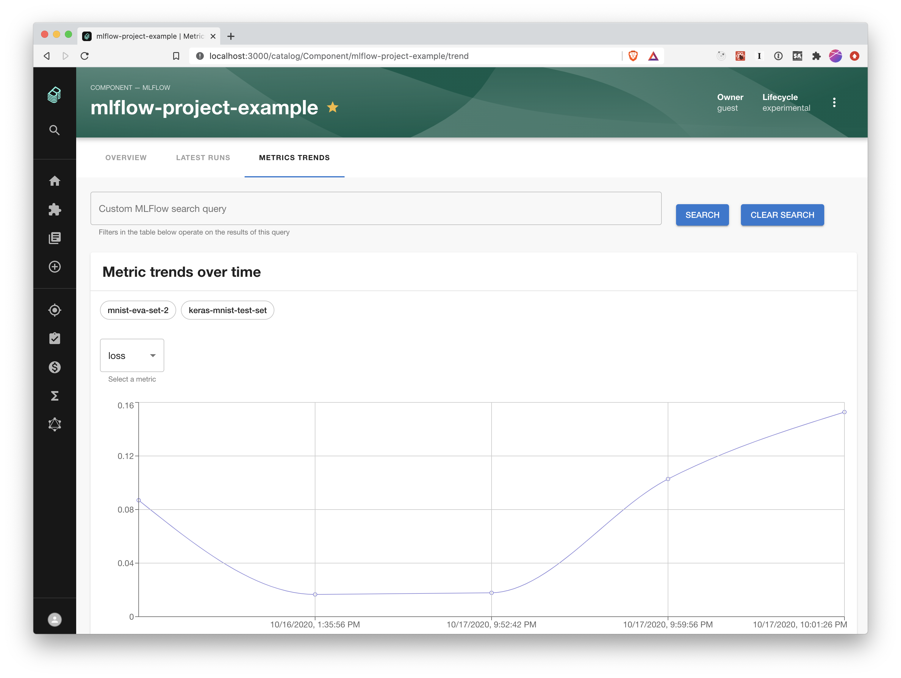
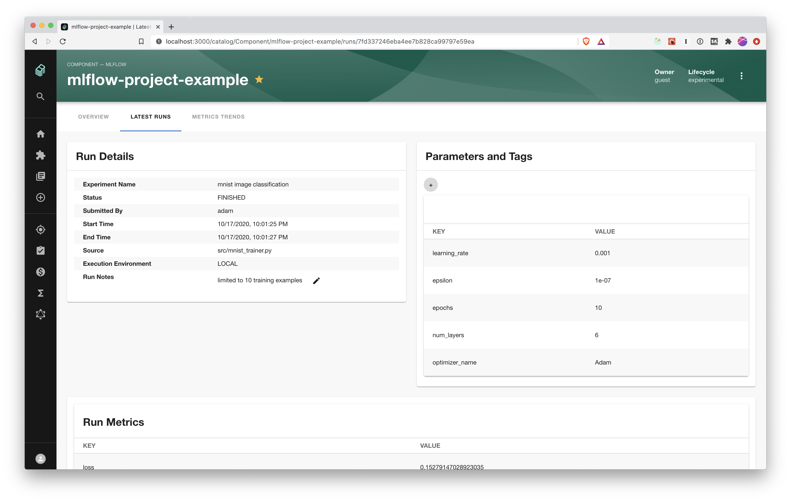
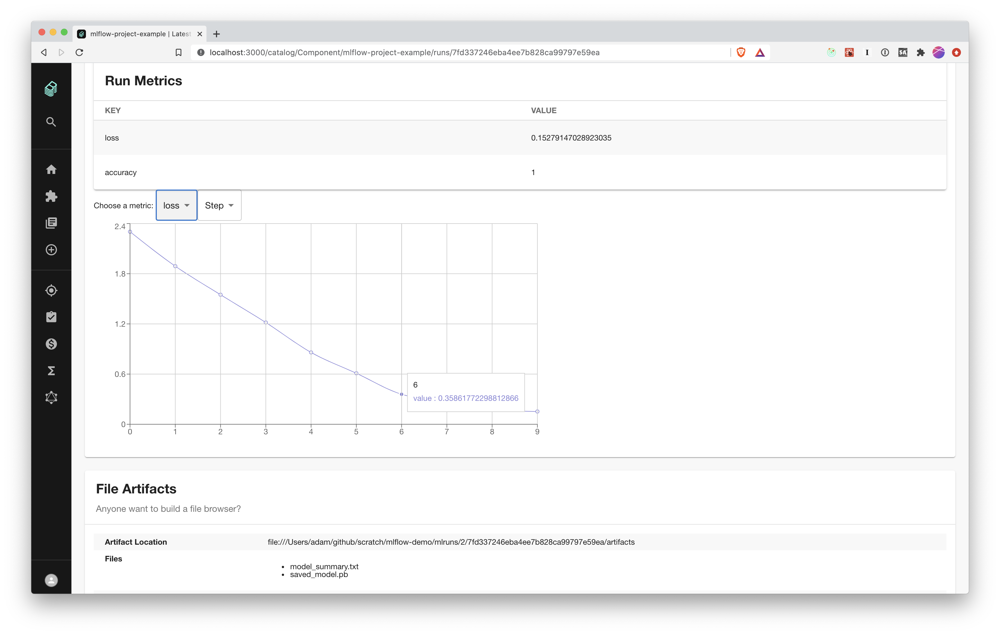

# mlflow

**Plugin Development Status: not even merged yet.**

Welcome to the mlflow plugin! The goal of this plugin is to meet feature parity with the default mlflow UI and add some additional features for tracking and comparing experiments over time. It also integrates MLFlow Experiments with the [Backstage software](https://backstage.io/docs/features/software-catalog/software-catalog-overview) so that your ML code can be organized with the data pipelines, backend services, or other Components that make up your ML system.

We've also introduced the concept of Evaluation Sets via tagging standards. Tagging a run with the `{key: 'mlflow.backstage.evaluation_set', value: '<your evaluation set ID>}` will let you filter and compare model metrics compared against the same Evaluation Set.

## Getting started with the backstage plugin

To use this plugin, you need to configure your MLflow server host in the proxy settings of `app-config.yaml`. It is currently set to `localhost:5000` which will work on a local mlflow server by running `mlflow server`.

You can register an MLFlow experiment as a Backstage Component by creating a `component-info.yaml` file in your repo that looks like the one below.

- The `spec/type` field should be set to `mlflow` to tell Backstage that this is an mlflow component
- the `metadata/annotations/mlflow.org/experiment` field should be set to the _string_ (quoted) experiment number. MLflow sometimes users Experiment names and sometimes numeric IDs. This must be the numeric ID.

```yaml
apiVersion: backstage.io/v1alpha1
kind: Component
metadata:
  name: mlflow-project-example
  description: A collection of MLFlow experiments.
  annotations:
    mlflow.org/experiment: '2'
  tags:
    - machine-learning
spec:
  type: mlflow
  lifecycle: experimental
  owner: guest
```

## Features

Backstage will display a list of all Components of type `mlflow`. You can "star" specific experiments to mark them as favorites, or filter by Experiment tag (as defined in your `component-info.yaml`), owner, or any other way of filtering Components.



### Run Comparison Views

When selecting a particular Experiment, you can see a list of all runs and their tags, metrics, and Evaluation Sets. You can filter this view by clicking on a particular Tag or Evaluation Set.

All runs:



Filtered by tag `mnist`:



You can also use the search query box to put any [mlflow search query](https://www.mlflow.org/docs/latest/search-syntax.html).



In addition, you can view metric trends over time for all runs in this particular Experiment.



### Run Details View

When clicking on any Run, you can see more details about the run itself, including start/end time, submission details, parameters, tags, notes, metrics, artifacts, and graphs of metrics produced during model training.



Loss metrics in this case were reported via `mlflow.keras.autolog()`. Also note that the artifact browser is not yet fully implemented!



## Usage in modeling code

This plugin uses the MLflow tracking API and shouldn't require much change from your usual workflow. See a basic working example [here](https://github.com/alaiacano/backstage-mnist). Some tips for successful use of this plugin are:

- Always set the Experiment Name in the beginning of your run via `mlflow.set_tracking_uri` and `mlflow.set_experiment`. Backstage tracks the `experiment_id` but mlflow makes you specify the corresponding `name` here!
- use `mlflow.set_tag('mlflow.backstage.evaluation_set', MY_EVALUATION_SET)` to record the name or ID of your evaluation set. This isn't required, but will allow you to filter runs in this Experiment for the ones evaluated against this dataset.
- Parent/child runs are not supported yet. If you have a use case for this, please reach out to see how we can support it.
- Using mlflow's `autolog` methods will post training loss metrics during each epoch, which can be viewed from the Run Details page.
